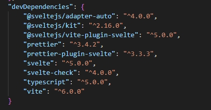

# APC440-GroupProject

APC Web Devlopment Group Project that I am doing solo.

## Installation

### Step 1 - Making sure Node.js is installed

Node.js is required to run this project

First, check if you already have Node.js on you system.
You can do this by running the following command in a terminal of your choice.

```
npm -v
```

If you get back a version number such as 22.0.0 then you have it installed! Feel free to move on

Don't worry, it's super simple!

The following command will install Node.js onto your system using Node Package Manager - npm for short.

- Run this command in any terminal of your choosing

```
npm install -g npm
```

If this doesn't work for you, you can use the Node.js installer instead located at:

```
https://nodejs.org/en
```

### Step 2 - Svelte plugin (Optional?)

If you're using PyCharm or any fancy text editor, there's limited Svelte support baked-in, but for rendering purposes
you should be okay.

If not (for any reason), follow these steps to install the supported plugin for Svelte - These steps are for PyCharm

- Note that this is for a general guideline, depending on your IDE these steps may vary such as VSCode using "Extensions"

1. Install the Svelte plugin:
2. Go to File → Settings → Plugins.
3. Search for Svelte.
4. Install the plugin by JetBrains.
5. Restart PyCharm.

### Step 3 - Install any dependencies if necessary

Once Node is installed, you'll have access to the package manager they provide for
running a svelte project!

- This is dependent upon where you currently are, but for example, this is what my terminal route looks like:

```
C:\Users\Lidde\Desktop\APC440-GroupProject\apc440-group-project>
```

At this point, checking for dependencies is a good idea just in case.
As of writing this, I have not installed any more than the one's described below and don't plan to,
however Svelte does have some that it requires, so running the install command is a good idea (keep reading to see it).

- Note that this does not install npm, but instead installs any dependencies if any are found!
- Dependencies are based on package.json, feel free to have a look!

Below is a snippet of the dependencies that Svelte requires and a couple basic one's I have installed such as Prettier and Typescript


The install command! Make sure you're in the same directory as I have described above :)

```
npm install
```

You may get freaked out if you see severity issues, but don't be! As long as it says something like "7 packages installed" then you're good to go!! Don't worry about running any commands that it suggests as they do not pertain to you :)

#### Here's an example of mine.

- Note that I already have these installed. So, if you'd like, try running `npm install` twice and see if you get a similar message.

```
up to date, audited 56 packages in 3s

7 packages are looking for funding
  run `npm fund` for details

3 low severity vulnerabilities

To address all issues (including breaking changes), run:
  npm audit fix --force

Run `npm audit` for details.
```

### Step 4 - Run the project!

Now you're ready to run the project! You should still be in the same source directory as described in step 3!

Run the following command to run the project on the default port:

```
npm run dev
```

You should see that the project is running on a specified port on localhost.
Go ahead and connect to it in the browser!!

#### Connection example

```

  VITE v6.2.0  ready in 1547 ms

  ➜  Local:   http://localhost:5173/
  ➜  Network: use --host to expose
  ➜  press h + enter to show help
```
